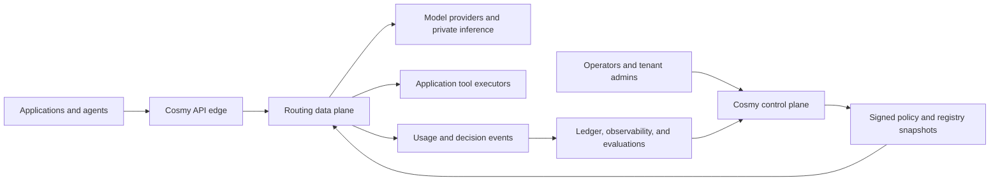
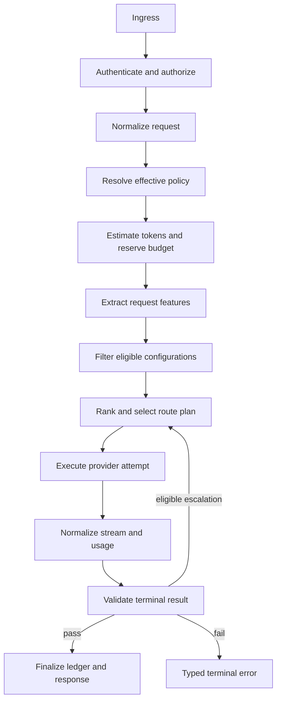

# System architecture

Status: Proposed.

## Architectural style

Cosmy separates a low-latency execution data plane from an eventually updated control plane.

The data plane accepts requests, applies signed configuration snapshots, routes traffic, proxies provider streams, validates results, and records decisions. It remains operational when most control-plane services are unavailable.

The control plane manages tenants, policies, provider credentials, model profiles, experiments, evaluation suites, deployment state, and snapshot publication.

## System context



## Data-plane request path



## Components

### API edge

Responsibilities:

- Terminate TLS and negotiate HTTP protocol.
- Authenticate API keys, OAuth tokens, or workload identities.
- Enforce coarse rate limits and request-size limits.
- Generate or validate request and trace identifiers.
- Route requests to a healthy regional router cell.
- Preserve cancellation and streaming backpressure.

The edge does not make model-selection decisions.

### Request normalizer

Responsibilities:

- Parse normalized and compatibility request shapes.
- Convert content into canonical message and part types.
- Validate tool and output schemas.
- Separate portable fields from provider extensions.
- Reject unsupported semantics before spending provider tokens.

Output is an immutable `CanonicalRequest`.

### Policy resolver

Responsibilities:

- Merge organization, tenant, project, API-key, session, and request policy layers.
- Apply deny-overrides semantics for security and privacy restrictions.
- Produce one immutable `EffectivePolicy` with source provenance.
- Reject unauthorized request-level relaxations.

### Budget service

Responsibilities:

- Estimate worst-case and expected request cost.
- Create a strongly consistent budget reservation.
- Reject requests that cannot fit policy limits.
- Reconcile reservation with provider-reported usage.
- Release unused reservation and record pricing version.

The hot path uses local price snapshots but authoritative reservations.

### Feature extractor

Responsibilities:

- Apply deterministic task and modality rules.
- Estimate input and output size.
- Invoke a bounded classifier only when policy allows and rule confidence is insufficient.
- Produce a versioned `RequestFeatures` record.

### Candidate engine

Responsibilities:

- Expand models into executable configurations.
- Apply hard capability, policy, health, region, budget, and context filters.
- Record a reason for every rejected candidate.
- Return only candidates safe to score.

### Ranker

Responsibilities:

- Estimate quality, cost, latency, failure risk, and cache benefit.
- Apply tenant objective weights and quality floors.
- Produce an ordered route plan with confidence and fallbacks.
- Use deterministic tie-breaking for replayability.

### Execution controller

Responsibilities:

- Acquire provider concurrency permits.
- Invoke adapters with deadlines and cancellation.
- Stream normalized events to the client.
- Handle retryable pre-stream failures.
- Prevent unsafe retries after visible output unless resumability is proven.
- Trigger policy-approved fallback or escalation.

### Provider adapters

Responsibilities:

- Translate canonical requests into native API requests.
- Translate native events, tool calls, usage, and errors into canonical events.
- Declare exact capabilities and semantic limitations.
- Preserve provider request identifiers for support and reconciliation.

### Validation service

Responsibilities:

- Run deterministic schema and business-rule validators.
- Invoke optional semantic graders outside or inside the response path according to policy.
- Return structured evidence and confidence.
- Never treat a grader’s prose as an executable instruction.

### Decision recorder

Responsibilities:

- Persist a compact immutable decision record.
- Emit detailed telemetry through a bounded asynchronous channel.
- Redact content according to retention policy.
- Ensure billing-critical events survive process termination.

## Cell architecture

The data plane is deployed as independent regional cells. A cell contains edge capacity, router workers, snapshot cache, provider connection pools, budget clients, event buffers, and health state.

Cells limit blast radius. They do not share mutable in-memory routing state. Global control-plane services publish versioned snapshots; cells independently acknowledge and activate them.

## Snapshot distribution

Each snapshot contains:

- Registry version and model profiles
- Policy bundle version
- Pricing version
- Provider endpoint metadata
- Feature flags and experiments
- Revocation list
- Signature and validity window

Routers verify signatures, schema compatibility, monotonic version rules, and activation time. The previous known-good snapshot remains available for rollback.

## Request state machine

```text
RECEIVED
  -> AUTHORIZED
  -> NORMALIZED
  -> BUDGET_RESERVED
  -> ROUTED
  -> PROVIDER_PENDING
  -> STREAMING
  -> VALIDATING
  -> SUCCEEDED | ESCALATING | FAILED | CANCELLED
  -> RECONCILED
```

Transitions are monotonic. `ESCALATING` creates a new attempt under the same request and budget envelope. `RECONCILED` is an accounting state and may occur after the client receives a terminal event.

## Multi-region behavior

- Requests enter the nearest policy-compliant region.
- Session affinity is preferred but not required for stateless routes.
- Stateful provider continuations remain pinned unless neutral state replay is available.
- Regional failover cannot move data to a forbidden geography.
- Budget scopes spanning regions use a globally consistent reservation authority or partitioned quotas.

## Dependency failure policy

- Snapshot service unavailable: continue with valid cached snapshot.
- Analytics unavailable: buffer bounded events and preserve billing records locally.
- Classifier unavailable: use deterministic route or conservative configured fallback.
- Budget authority unavailable: fail closed for strict budgets; optionally use signed emergency allowance.
- Provider unavailable: choose eligible fallback.
- Validator unavailable: follow policy; high-risk routes fail closed, low-risk routes may return with validation status.

## Technology boundaries

The design does not mandate one programming language. The hot path benefits from a memory-safe runtime with strong asynchronous I/O, predictable cancellation, and mature HTTP streaming. TypeScript/Node.js, Go, and Rust are reasonable options. Python is suitable for evaluation and offline analysis; it is not required in the data plane.
